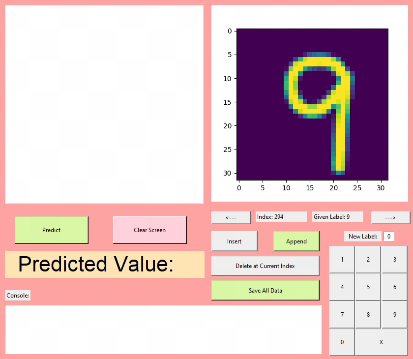

# Digit Drawing And Recognizing Program

- It is a program that allows the user to draw a digit and clarify it as well as save the image data and index through existing saved data.
- It uses the MNIST digits dataset for training and a self made dataset for testing that was collected  in person from random individuals.
- This program was originally made as part of my collage major project.
